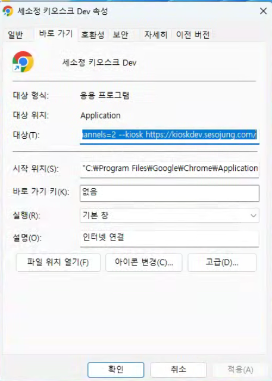

# 필수 프로그램의 설치와 설정

세소정은 웹으로 제공되는 서비스이며, 다음 프로그램들을 설치해야 동작합니다.

* [크롬 (웹브라우져) ](./#undefined): 세소정을 실행하기 위한 웹브라우져입니다.
* [Rustdesk (원격접속 프로그램)](./#rustdesk) : 원격 지원을 받거나 판매자가 직접 키오스크를 제어합니다.
* [결제 에이전트](./#undefined-8) : 카드 리더로 결제 프로그램입니다.

## 크롬 브라우져

크롬 설치 후 단축아이콘을 바탕화면에 생성 한 후 단축 아이콘의 설정을 열고 '대상'에 새소정 실행 설정의 접속 정보를 저장하세요.

<figure><figcaption></figcaption></figure>

### 세소정 실행 설정

개발 중인 기능을 실행해볼 수 있으며, 판매 상품은 실적으로 남지 않으니 테스트 후 반드시 거래 취소해야 합니다.

세소정은 디버깅 모드와 키오스크 모드로 실행할 수 있습니다.

* 디버깅 모드 : 일반적인 크롬의 실행과 동일하게 다른 창을 함께 이용할 수 있습니다.
* 키오스크 모드 : 세소정이 전체 화면으로 실행되어 다른 창을 이용  할 수 없습니다.

**개발 서버용**




핀치 제스쳐 허용

```bash
"C:\Program Files\Google\Chrome\Application\chrome.exe" --user-data-dir="C:\sesojung-dev-normal" --disable-web-security --disable-notifications https://kioskdev.sesojung.com/
```



핀치 제스쳐 허용

```bash
"C:\Program Files\Google\Chrome\Application\chrome.exe" --user-data-dir="C:\sesojung-dev-kiosk" --disable-web-security --disable-notifications --kiosk https://kioskdev.sesojung.com/"
```




개발 서버 접속 시에는 일반디버깅  모드'와 '키오스크 모드'에서 핀치 제스쳐를 허용합니다.


**상용 서버용**



핀치 제스쳐 불가

```sh
"C:\Program Files\Google\Chrome\Application\chrome.exe" --user-data-dir="C:\sesojung-prod-kiosk" --disable-web-security --disable-notifications --disable-pinch --kiosk https://ki.sesojung.com/"
```



핀치 제스쳐 허용

```bash
"C:\Program Files\Google\Chrome\Application\chrome.exe" --user-data-dir="C:\chrome-prod-normal" --disable-web-security --disable-notifications https://ki.sesojung.com/"
```




상용 서버 접속 시에는 '일반 디버깅 모드'에서만 핀치 제스처를 허용합니다.


변경된 단축아이콘은 시작프로그램으로 등록하여 윈도우가 시작될 때마다 접속하도록 합니다.( [envsetting.md](initialize/envsetting.md "mention")/[#undefined-7](initialize/envsetting.md#undefined-7 "mention"))


## 원격  접속 프로그램(Rustdesk)

### rustdesk 다운로드

[rustdesk-1.2.3-1-x86\_64.exe](https://github.com/rustdesk/rustdesk/releases/download/1.2.3-1/rustdesk-1.2.3-1-x86\_64.exe)

### rustdesk 설정

rustdesk 설치 후 영구 비밀번호를 지정해야 합니다.

rustdesk를 실행하여 좌측 패널의 `설정`을 클릭합니다.

설정화면의 좌측 패널에서 `security`를 선택한 후 우측 패널에서 `영구 비밀번호`를 설정합니다.

영구 비밀번호는 사전 정의된 값을 입력합니다.

알파미트의 업무 담당자에게 rustdesk ID와 영구비밀번호를 전달합니다.


## 결제 에이전트

V POS와 mtouch\_pos를 설치하고 실행하는 과정입니다.

### KOVAN 에이전트의 다운로드와 설치

VPOS를 다운로드 후 설치합니다.



설치 후 실행하여 로그인 합니다.

* ID : 0000
* PW : 1234

단말기 인증 메뉴로 들어가서 카드 리더의 정보를  입력합니다.

* 단말기 번호 : PG에서 발급해준 TID를 입력합니다.
* 시리얼 번호 : 카드 리더 뒷면의 일련번호를 입력합니다. (첫 두자리 0은 자동 입력됩니다.)

<figure><figcaption></figcaption></figure>

정보 저장, 사용자 인증, 가맹점 인증, KEY 다운로드, 창닫기 순으로 각 단계를 완료하면서 실행하면 설정이 완료됩니다.


2024년 6월 이전 키오스크 일부 기기는 KOVAN의 결제에이전트 VPOS 대신KSNET의 결제 에이전트를 사용합니다.


<details>

<summary>KSNET 결제 에이전트 설정 (2024년 6월 이전 키오스크)</summary>

다음   내용은 2024년인10월기준하여 인천 축협의 일부 기기만 해당합니다.

KSNET 결제 에이전트는 KOVAN V POS와 호환되지 않습니다.

### KSNET 에이전트

[#ksnet](./#ksnet "mention")를 다운로드하여  설치하고 실행하세요.

에이전트 실행 후 다음과 같이 설정합니다.

1. 실행하여 "1. 암호화 리더기"의 `'자동 검색'` 클릭합니다.
2. 포트가 정상적으로 잡히면 `'테스트'`하여 무결성 을 점검합니다.
3. 상기 1\~2번이 모두 완료되면 하단의 `'서비스 시작'`을 클릭하여 에이전트 실행을 완료합니다.


실행  중인 KSCAT은 화면 하단의 작업표시줄에서 클릭하여다시 열 수 있습니다.


### mTouch 결제 에이전트

[#mtouch](./#mtouch "mention")를    다운로드하세요.

실행 파일을 더블클릭하여 실행하면 창을 최소화 또는 창닫기를 하여도 실행됩니다.

mTouch 결제 에이전트는 설정 과정이 없습니다.

</details>


## 홍보 미디어 다운로드

대기화면의 홍보 미디어를 정해진 디렉토리에 다운로드 합니다.

도스 명령어 실행환경 (CLI)에서 다음 명령을 실행합니다.

```shell

mkdir c:/media && curl -o c:/media/media720p.mp4 http://kwonps.iptime.org:8200/media/media720p.mp4
// c 드라이브에 media 디렉토리를 생성합니다.
// media 디렉토리에 media.mp4 파일을 다운로드 합니다.
```

또는 다음 URL에서 미디어 파일을 다운로드 후 `c:/media` 디렉토리에 저장합니다.

```url
http://kwonps.iptime.org:8200/media/media.mp4
```
